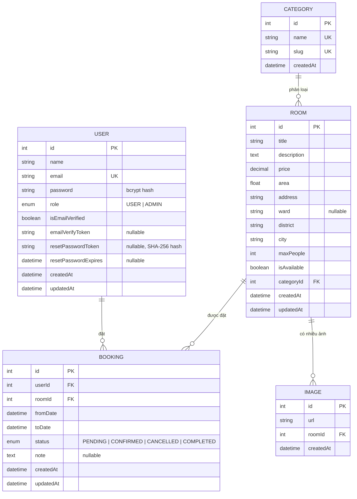
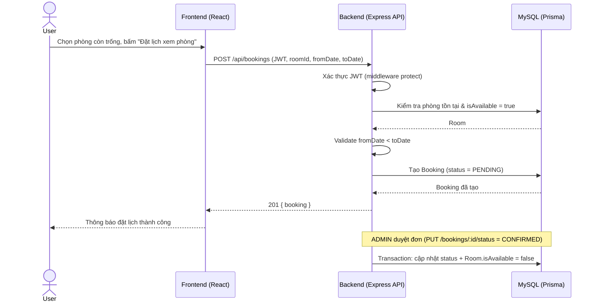

# Phân tích hệ thống — Tổ Ấm (Website Cho Thuê Phòng Trọ)

Tài liệu này bổ sung phần **ý tưởng & phân tích hệ thống** (ERD, use-case, luồng hoạt động)
tương ứng tiêu chí 1 (1.0đ) trong bảng chấm điểm, đi kèm với `README.md` (hướng dẫn chạy),
`SECURITY.md` (bảo mật) và `TESTING.md` (kiểm thử).

## 1. Ý tưởng & phạm vi

"Tổ Ấm" là website cho thuê phòng trọ, phục vụ 2 nhóm người dùng:

- **Khách (USER)**: tìm/lọc phòng trọ theo khu vực, giá, danh mục; xem chi tiết phòng; đăng ký/đăng
  nhập; đặt lịch xem phòng; theo dõi và tự huỷ đơn của mình.
- **Quản trị viên (ADMIN)**: quản lý danh sách phòng (CRUD), duyệt/huỷ đơn đặt phòng, quản lý vai
  trò người dùng, xem thống kê tổng quan (dashboard).

## 2. Sơ đồ ERD (thực thể - quan hệ)

Sơ đồ dưới đây khớp 1:1 với `backend/prisma/schema.prisma` (nguồn chân lý duy nhất cho cấu trúc
dữ liệu — mọi thay đổi schema phải cập nhật lại sơ đồ này).



**Ghi chú thiết kế:**
- `Category 1—n Room`, `Room 1—n Image` (xoá phòng thì xoá luôn ảnh nhờ `onDelete: Cascade`),
  `User 1—n Booking`, `Room 1—n Booking`.
- Index trên `Room.categoryId`, `Room.district`, `Room.price` để tối ưu tìm kiếm/lọc — đây là các
  trường được lọc thường xuyên nhất trong `GET /api/rooms`.
- `resetPasswordToken` lưu dạng hash (không lưu token gốc) để dù lộ database cũng không dùng được
  token đặt lại mật khẩu trực tiếp.

## 3. Use case chính

| Actor | Use case | Điều kiện | Kết quả |
|---|---|---|---|
| Khách vãng lai | Tìm kiếm/lọc phòng | Không cần đăng nhập | Danh sách phòng khớp bộ lọc, có phân trang |
| Khách vãng lai | Xem chi tiết phòng | Không cần đăng nhập | Thông tin đầy đủ + toàn bộ ảnh |
| USER | Đăng ký/Đăng nhập | Email chưa tồn tại (đăng ký) | Nhận JWT, tạo phiên đăng nhập |
| USER | Quên/Đổi mật khẩu | Có tài khoản | Nhận email reset, đổi mật khẩu thành công |
| USER | Đặt lịch xem phòng | Đã đăng nhập, phòng còn trống | Tạo `Booking` trạng thái `PENDING` |
| USER | Xem/Huỷ đơn của mình | Đã đăng nhập, là chủ đơn | Danh sách đơn cá nhân; huỷ được khi đơn chưa `COMPLETED` |
| ADMIN | CRUD phòng | Role `ADMIN` | Thêm/sửa/xoá phòng, ảnh liên kết |
| ADMIN | Duyệt/huỷ đơn đặt phòng | Role `ADMIN` | Đổi trạng thái đơn, đồng bộ `isAvailable` của phòng |
| ADMIN | Quản lý vai trò user | Role `ADMIN` | Nâng/hạ quyền USER ↔ ADMIN |
| ADMIN | Xem dashboard thống kê | Role `ADMIN` | Tổng user/phòng/đơn, số phòng trống, đơn chờ duyệt |

## 4. Luồng hoạt động chính (đặt phòng)



## 5. Kiến trúc hệ thống (triển khai)

```
Người dùng
   │  HTTPS
   ▼
Vercel (Frontend: React + Vite, static hosting + CDN)
   │  fetch /api/* (HTTPS, CORS whitelist theo CLIENT_URL)
   ▼
Render (Backend: Node.js + Express, container)
   │  Prisma Client (kết nối SSL tới DB)
   ▼
Railway (MySQL managed database)
```

CI/CD: mỗi lần push nhánh `main` → GitHub Actions chạy lint + test + build (`ci.yml`) → nếu qua,
workflow `deploy.yml` gọi deploy hook của Render (backend) và Vercel (frontend) để tự động deploy
bản mới nhất.
